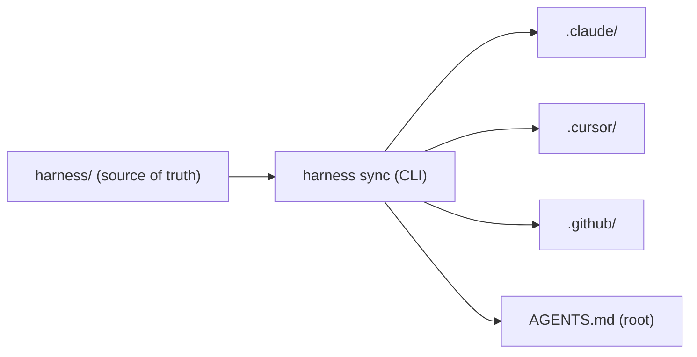
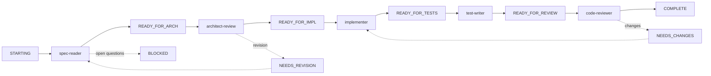

# Developer Harness

A tool-agnostic developer harness for spec-driven development. One source of truth for agent roles, slash commands, hooks, and skills; native configs generated for Claude Code, Cursor, and GitHub Copilot.

## Why

AI coding agents are most useful when they share a consistent operating model across teams and tools. This harness gives you:

- A five-stage spec-driven pipeline (`spec-reader` → `architect-review` → `implementer` → `test-writer` → `code-reviewer`) coordinated by an explicit agent queue.
- One canonical definition for each agent, command, hook, and skill, written once and projected into every supported coding tool.
- A small Node CLI (`harness sync`) that regenerates tool-specific configs on demand.

## Prerequisites

- Node.js 20 or newer.
- At least one of: Claude Code, Cursor, or a repository that uses GitHub Copilot Workspace / Copilot Chat.

## Quick start

```bash
# From the repository root:
node harness/bin/harness.mjs init     # writes harness.config.json if missing
node harness/bin/harness.mjs sync     # generates .claude/, .cursor/, .github/, AGENTS.md
node harness/bin/harness.mjs status   # prints current pipeline queue
```

To run the harness's own test suite (state machine, frontmatter parser,
hook scripts):

```bash
cd harness && npm test    # runs `node --test "tests/*.test.mjs"`
```

To install the CLI globally so you can run `harness` from anywhere:

```bash
npm install -g ./harness
harness sync
```

## Architecture



The pipeline state machine, queue file, hook scripts, and agent role specs live under `harness/`. The CLI reads `harness/harness.config.json` and writes native configs into each tool's expected directory. Generated files carry a banner reminding contributors to edit the source in `harness/` rather than the generated copy.

### Pipeline state machine



State transitions are encoded once in [`src/queue/state-machine.mjs`](src/queue/state-machine.mjs) and consumed by every hook and CLI subcommand.

## Configuration

`harness/harness.config.json` controls which targets are generated, where the canonical files live, and per-tool defaults. Useful keys:

- `targets` — any combination of `claude`, `cursor`, `copilot`, `agents-md`.
- `paths.*` — relative paths (from repo root) to the canonical content directories.
- `pipeline.stages` — ordered list of pipeline stages. Each stage's `readyStatus`/`activeStatus`/`completedStatus` drives the queue state machine used by the hooks and CLI, and the stage order drives agent colors and Copilot handoffs. If you customize stages, also update the agent prompt files — they write status strings literally.
- `hooks.guard.extraPatterns` — project-specific regex patterns to block in shell commands. Each entry is `{ pattern, flags, reason }`.
- `hooks.lint.commands` — map of glob → shell command, run by the lint-and-format hook after a file write.
- `claude.model` — optional. When set (e.g. `"claude-sonnet-4-5"`) it is written into `.claude/settings.json` and every agent's frontmatter. Leave `null` to let Claude Code use the session default (`inherit`), which is more future-proof.
- `claude.permissionMode` — permission mode written to `.claude/settings.json` as `permissions.defaultMode`. One of `default`, `acceptEdits`, `plan`, `bypassPermissions`.
- `cursor.protectedBranches` — branch names (globs allowed) that the destructive-command guard refuses to `git push` to (including `--delete` and `:branch` refspecs) or force-reset with `git branch -f`.
- `copilot.emitPrompts` — whether to write `.github/prompts/*.prompt.md` files.

## Adding content

| Want to | Edit |
| --- | --- |
| Change a project rule that applies everywhere | `harness/AGENTS.md` |
| Add or refine an agent role | `harness/agents/<name>.md` |
| Add a slash command | `harness/commands/<name>.md` |
| Add a domain knowledge pack | `harness/skills/<name>/SKILL.md` |
| Add a feature spec | `harness/specs/<name>.md` (copy from `harness/templates/spec.template.md`) |
| Add a custom hook | `harness/hooks/<name>.mjs` then wire it in `harness.config.json` |

Run `harness sync` after any edit.

## Generated outputs

Each target gets the closest native equivalent of every harness concept.

| Concept | Claude Code | Cursor (2.4+) | GitHub Copilot (VS Code 1.106+) |
| --- | --- | --- | --- |
| Project guidance | `.claude/CLAUDE.md` (via `AGENTS.md`) | `AGENTS.md` (root) | `.github/copilot-instructions.md` |
| Agent role | `.claude/agents/<name>.md` | `.cursor/agents/<name>.md` | `.github/agents/<name>.agent.md` (with `handoffs` between pipeline stages) |
| Skill | `.claude/skills/<name>/SKILL.md` | `.cursor/skills/<name>/SKILL.md` | `.github/skills/<name>/SKILL.md` |
| Slash command | `.claude/commands/<name>.md` | `.cursor/commands/<name>.md` | `.github/prompts/<name>.prompt.md` |
| Hooks | `.claude/settings.json` (`Pre/PostToolUse`, `Stop`, `SubagentStop`) | `.cursor/hooks.json` (`beforeShellExecution`, `afterFileEdit`, `stop`, `subagentStop`) | `.github/hooks.json` (`PreToolUse`, `PostToolUse`, `Stop`, `SubagentStop`) |

The same hook scripts in `harness/hooks/` are reused across all three tools. They accept both Claude-style snake_case tool inputs (`tool_input.file_path`) and VS Code's camelCase / array shapes (`tool_input.filePath`, `tool_input.files[]`).

Claude-specific niceties baked into the sync:

- `.claude/CLAUDE.md` `@-imports` the root `AGENTS.md`. Claude Code does **not** auto-load `AGENTS.md`, so this bridge is required for the same project guidance to appear in Claude sessions.
- Pipeline-stage agents get a `color:` field (blue → cyan → purple → green → orange) so each subagent is easy to spot in the transcript.
- Commands whose source frontmatter sets `argument-hint:` (or whose body references `$ARGUMENTS`) get a hint surfaced in Claude's slash-command autocomplete.

## Common issues

- **`harness sync` reports "no targets configured"** — check `harness/harness.config.json` has a non-empty `targets` array.
- **Generated files keep getting overwritten** — they should be. Edit the source under `harness/` and re-run sync.
- **Upgrading from an older harness version** — `harness sync` auto-prunes legacy generated files (identified by the "GENERATED BY harness sync" banner). Empty legacy directories like `.cursor/rules/` and `.github/chatmodes/` can be deleted manually.

## CLI reference

```text
harness init                   # create harness.config.json from defaults
harness sync [--target NAME]   # regenerate one or all tool configs
harness status                 # print the current queue (same as /pipeline-status)
harness queue reset            # clear queue/agent-queue.json (asks before writing)
```
